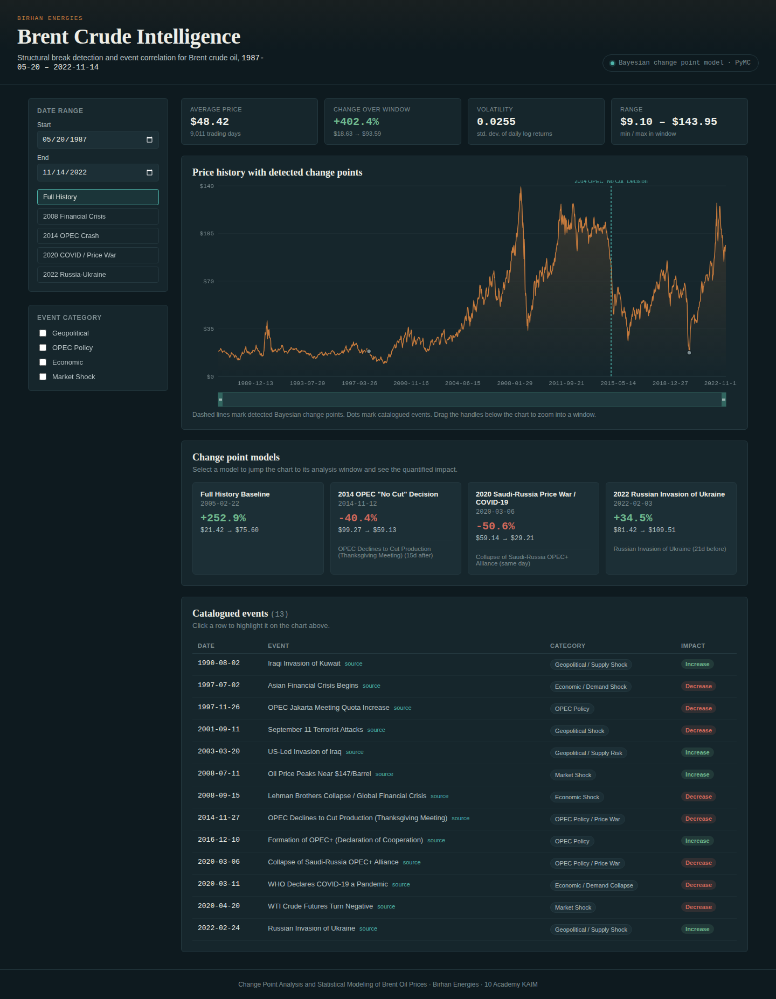
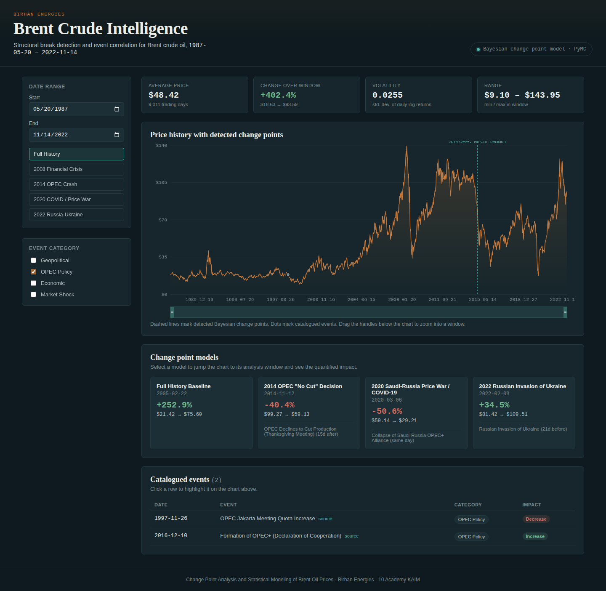
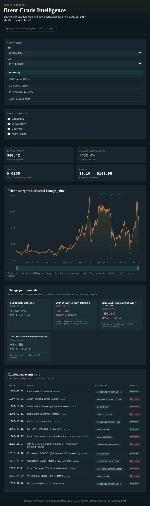
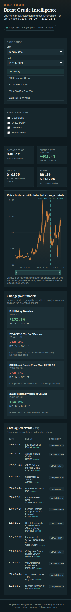

# Brent Oil Change Point Analysis

Change point analysis and statistical modeling of Brent crude oil prices to
detect structural breaks and associate them with major political and
economic events (OPEC decisions, geopolitical conflicts, sanctions, etc.).


## Objectives

1. Identify key events that significantly impacted Brent oil prices over
   the past several decades.
2. Quantify how much these events affect price changes using Bayesian
   change point detection (PyMC).
3. Provide clear, data-driven insights for investment strategy, policy, and
   operational planning, delivered via an interactive dashboard.

## Data Source

- **Brent oil prices:** `data/BrentOilPrices.csv` daily Brent crude oil
  prices in USD/barrel, 20-May-1987 to 14-Nov-2022.
- **Key events dataset:** `data/key_events_verified.csv` 13 fact-checked
  geopolitical, OPEC, and economic events with approximate dates,
  descriptions, and cited sources.

## Project Structure

```
├── .vscode/
│   └── settings.json
├── .github/
│   └── workflows/
│       └── unittests.yml
├── .gitignore
├── requirements.txt
├── README.md
├── data/
│   ├── BrentOilPrices.csv
│   └── key_events_verified.csv
├── docs/
│   └── analysis_workflow.md
├── src/
│   ├── __init__.py
│   └── data_loader.py
├── notebooks/
│   ├── __init__.py
│   └── 01_eda.ipynb
├── backend
├── tests/
│   ├── __init__.py
│   ├── test_placeholder.py
│   └── test_data_loader.py
└── scripts/
    ├── __init__.py
    └── README.md
```

## Setup

```bash
git clone <your-repo-url>
cd brent-oil-change-point-analysis
python -m venv venv
source venv/bin/activate   # Windows: venv\Scripts\activate
pip install -r requirements.txt
```

## Running the Tests

```bash
pytest tests/ -v
```

## Running the EDA Notebook

```bash
jupyter notebook notebooks/01_eda.ipynb
```

## Tasks

- **Task 1** Workflow definition (`docs/analysis_workflow.md`), event
  research (`data/key_events_verified.csv`), EDA and change point model
  explanation (`notebooks/01_eda.ipynb`).
- **Task 2** Bayesian change point modeling in PyMC, convergence checks,
  impact quantification, association with events.
- **Task 3** Interactive dashboard (Flask backend + React frontend).

## Task 2: Bayesian Change Point Modeling

**Notebook:** `notebooks/02_change_point_model.ipynb`

Implements a Bayesian change point model (PyMC) to detect and quantify
structural breaks in Brent oil prices, and associates detected breaks
with the researched events dataset.

**Baseline model** — a single change point fit over the full 1987–2022
price history. Converges cleanly (r_hat = 1.00 across all parameters) and
identifies **22 Feb 2005** as the largest structural break, with mean
price shifting from **$21.42 to $75.60 (+252.9%)**. This reflects the
mid-2000s commodity supercycle rather than one discrete event.

**Focused case studies** — the same model applied to shorter windows
around three specific researched events, for sharper, event-level
results:

| Case | Change point | Mean shift | % change | r_hat |
|---|---|---|---|---|
| 2014 OPEC "no cut" decision | 2014-11-12 | $99.33 → $59.24 | -40.4% | 1.00 |
| 2020 Saudi-Russia price war / COVID-19 | 2020-03-06 | $59.14 → $29.21 | -50.6% | 1.00 |
| 2022 Russian invasion of Ukraine | 2022-02-03 | $81.42 → $109.51 | +34.5% | 1.01 |

All models pass convergence diagnostics (r_hat ≈ 1.00, healthy trace
plots, `az.plot_trace`/`az.summary`). Detected change points align
closely with real-world triggers, though — consistent with Task 1's
foundational assumption — these are reported as statistical correlation
in time, not proven causation.

The notebook also includes a written discussion of advanced extensions
(macroeconomic covariates, VAR, Markov-switching models) as future work.

**Core module:** `src/change_point_model.py` — reusable, unit-tested
(`tests/test_change_point_model.py`) implementation of the switch-point
model (`tau`, `mu1`, `mu2`, `sigma`, `pm.math.switch`, MCMC via
`pm.sample()`).

## Task 3: Interactive Flask/React Dashboard

**Location:** `backend/`

An interactive dashboard for exploring the Brent oil change point
analysis: historical prices, detected Bayesian change points, and the
researched events dataset, all in one filterable view.

### Architecture
backend/
├── app.py                          # Flask API + serves built React app
├── requirements.txt
├── tests/test_app.py                # 9 passing tests
├── scripts/export_change_points.py  # regenerates change point JSON
├── data/
│   ├── BrentOilPrices.csv
│   ├── key_events_verified.csv
│   └── change_point_results.json    # static export of Task 2 results
├── screenshots/
└── frontend/                        # React (Vite) app
└── src/
├── App.jsx
├── api.js
├── dashboard.css
└── components/
├── Header.jsx
├── FilterPanel.jsx
├── PriceChart.jsx
├── StatsCards.jsx
├── ChangePointCards.jsx
└── EventTable.jsx
`change_point_results.json` is a static export of the Task 2 notebook's
results, so the backend does not require PyMC at runtime — only `flask`,
`flask-cors`, `pandas`, and `numpy`.

### API Endpoints

| Endpoint | Description |
|---|---|
| `GET /api/health` | Backend + data-load status check |
| `GET /api/prices?start=&end=` | Historical daily prices |
| `GET /api/change-points` | Bayesian change point model results |
| `GET /api/events?start=&end=&category=` | Researched events |
| `GET /api/stats?start=&end=` | Avg price, volatility, min/max, % change for a window |

### Setup

#### 1. Backend (Flask)

```bash
cd backend
python -m venv venv
source venv/bin/activate      # Windows: venv\Scripts\activate
pip install -r requirements.txt
python app.py
```

API runs at `http://localhost:5000`. Check with `curl http://localhost:5000/api/health`.

#### 2. Frontend (React) — development mode

In a **second terminal**, with the backend still running:

```bash
cd backend/frontend
npm install
npm run dev
```

Open the URL Vite prints (typically `http://localhost:5173`). The dev
server proxies `/api/*` to Flask on port 5000.

#### 3. Production mode (single server)

```bash
cd backend/frontend
npm install
npm run build
cd ..
python app.py
```

Visit `http://localhost:5000` — Flask serves the built React app and API
together.

### Dashboard Features

- **Price chart** with dashed change-point markers and event dots, plus
  a brush control for click-and-drag zooming
- **Date range filtering** — manual pickers + one-click event presets
  (2008 crisis, 2014 OPEC crash, 2020 COVID/price war, 2022
  Russia-Ukraine)
- **Event category filters** Geopolitical / OPEC Policy / Economic /
  Market Shock
- **Change point drill-down** click a model card to jump the chart to
  that event's window and see its quantified impact
- **Event highlight** click a table row to highlight it on the chart
- **Key indicators** average price, % change, volatility, price range,
  recalculated live per window
- **Responsive layout** verified at desktop, tablet, and mobile
  breakpoints (see screenshots below)

### Screenshots

| Desktop | Filtered |
|---|---|
|  |  |

| Tablet | Mobile |
|---|---|
|  |  |
